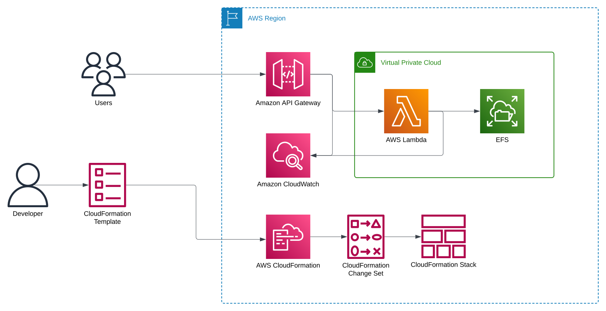

# IaC Django Serverless Starter for AWS

This project demonstrates how to deploy a Django application utilizing a *fully* serverless architecture on AWS. It uses AWS Lambda as the execution environment, SQLite as the database, and CloudFormation/SAM for infrastructure provisioning. The setup includes a local development environment using VS Code and Docker/Devcontainer. Please note that this project is intended for demonstration purposes and is not suitable for production use (see Limitations section).

## Table of Contents

1. [Demo](#demo)
2. [Architecture](#architecture)
3. [Installation](#installation)
4. [Usage](#usage)
5. [Limitations](#limitations)
6. [License](#license)
7. [Disclaimer](#disclaimer)

## Demo

A basic Django polls application:

- [Live Demo](https://cluf0ujerl.execute-api.us-east-1.amazonaws.com/)
- [Admin Portal](https://cluf0ujerl.execute-api.us-east-1.amazonaws.com/admin/) (read-only)
  - **Username:** demo
  - **Password:** djangoserverless

## Architecture

### Overview

This project deploys a Django application in a serverless environment, leveraging various AWS services for seamless scalability and management.

### Services

The architecture consists of the following services:

1. [AWS Lambda](https://aws.amazon.com/lambda/)
2. [Amazon API Gateway](https://aws.amazon.com/api-gateway/)
3. [Amazon VPC](https://aws.amazon.com/vpc/)
4. [Amazon EFS](https://aws.amazon.com/efs/)
5. [AWS CloudFormation](https://aws.amazon.com/cloudformation/)
6. [AWS SAM](https://aws.amazon.com/serverless/sam/)
7. [Amazon CloudWatch](https://aws.amazon.com/cloudwatch/)

### Diagram



### Database

The SQLite database file is stored on EFS, which is automatically mounted to every launched Lambda function.

### HTTP & ASGI

This project uses the [AWS Lambda Web Adapter](https://github.com/awslabs/aws-lambda-web-adapter) as a bridge between Django's [ASGI application](https://docs.djangoproject.com/en/5.0/howto/deployment/asgi/) and Amazon API Gateway.

### Static Files

Static files are served from EFS by Lambda via an ASGI application [blacknoise](https://github.com/matthiask/blacknoise) and API Gateway.

### Advantages

This serverless approach offers several benefits:

1. Eliminates the need for running EC2/RDS instances.
2. Avoids leasing IPv4 addresses.
3. Can seamlessly scale down to zero.
4. Small projects can run almost entirely within AWS Free Tier limits.
5. High availability: the application is deployed across three availability zones.

### Disadvantages

This approach has notable drawbacks primarily due to the use of SQLite in conjunction with network-attached storage:

1. Lack of support for concurrent writes: SQLite relies on file locking for database consistency, but Amazon EFS only supports [advisory locking](https://docs.aws.amazon.com/efs/latest/ug/features.html#consistency). Since read/write operations don't check for conflicting locks before executing, concurrent writes can lead to database corruption. This makes the setup unsuitable for multi-writer scenarios.

2. Relatively high latency: Even basic applications that perform database queries may experience latency exceeding 80 milliseconds with read requests and over 150 milliseconds with write requests.

3. Relatively slow [cold start](https://docs.aws.amazon.com/lambda/latest/operatorguide/execution-environments.html): Initial startup takes over 1 second, which may affect responsiveness and user experience, especially in time-sensitive applications.

## Installation

### Prerequisites

Ensure the following are installed and configured:

1. [Docker](https://www.docker.com/)
2. [VS Code](https://code.visualstudio.com/)
3. [Dev Containers](https://marketplace.visualstudio.com/items?itemName=ms-vscode-remote.remote-containers)
4. [AWS Account](https://aws.amazon.com/)
5. AWS Credentials ([Single-Sign On](https://aws.amazon.com/iam/identity-center/) or [Access Keys](https://docs.aws.amazon.com/IAM/latest/UserGuide/id_credentials_access-keys.html))

### Launch Locally

1. Clone this repository:

```sh
git clone https://github.com/efficient-solutions/aws-iac-django-serverless-starter.git
```

2. Open the project in a Dev Container in VS Code.

3. Apply the Django database migration by running the following command in the VS Code terminal:

```sh
python src/manage.py migrate
```

4. Create a superuser by running the following command in the VS Code terminal:

```sh
python src/manage.py createsuperuser
```

5. Launch the Django application from the VS Code menu: `Run > Run Without Debugging`.

## Usage

### Build & Deploy

Before proceeding to the deployment, add your [AWS credentials](https://docs.aws.amazon.com/cli/latest/userguide/cli-chap-authentication.html) to the current environment. Then, execute the following commands in the VS Code terminal:

#### 1. Build a deployment package

```sh
sam build
```

#### 2. Deploy the stack and the application

```sh
sam deploy --guided
```

#### 3. Apply the database migrations

```sh
sam remote invoke Function --event '{"manage":"migrate"}' --stack-name aws-iac-django-serverless-starter
```

#### 4. Collect the static files

```sh
sam remote invoke Function --event '{"manage":"collectstatic"}' --stack-name aws-iac-django-serverless-starter
```

#### 5. Create a superuser

```sh
sam remote invoke Function --event '{"manage":"create_superuser"}' --stack-name aws-iac-django-serverless-starter
```

> This command creates a superuser `root` with a randomly-generated password which is returned in the output. Change this password once you log in. Also, this command can only be run once.

### Launch Remotely

After successfully deploying, you will receive an `HttpApiUrl` output. Open this URL in your browser.

> Due to the limitations of static serving from the Lambda function, it may take several minutes after running the `collectstatic` command before all static files are available. During this time, you may encounter occasional HTTP 404 errors.

### Clean Up

To delete all the resources created within the stack, run the following command. This process can take over 5-10 minutes.

```sh
sam delete
```

## Limitations

This project is intended for development and testing purposes only. It is not suitable for production due to the following limitations:

1. Concurrent writes can lead to database corruption.
2. Static files are served by Lambda, which is slow, resource-intensive, and potentially costly.
3. No option for handling media files.
4. No option for adding a custom domain.
5. No option for connecting to other AWS services or any external APIs from Lambda.
6. The `/events` endpoint, which handles [non-HTTP events](https://github.com/awslabs/aws-lambda-web-adapter#non-http-event-triggers), is publicly accessible and unprotected.
7. Django's secret key is set with SAM CLI and insecurely stored in an environment variable.
8. Django's `ALLOWED_HOSTS` setting is configured with a wildcard by default, posing a security risk.

## Production Use

For those considering this architecture for production environments, we recommend exploring our [commercial version](https://efficient.solutions/aws-iac-django-serverless-basic/), which addresses all the limitations mentioned above.

## License

This software is released under the [GNU GPLv3](LICENSE) license.

## Disclaimer

This software product is not affiliated with, endorsed by, or sponsored by Amazon Web Services (AWS) or Amazon.com, Inc. The use of the term "AWS" is solely for descriptive purposes to indicate that the software is compatible with AWS services. Amazon Web Services and AWS are trademarks of Amazon.com, Inc. or its affiliates.